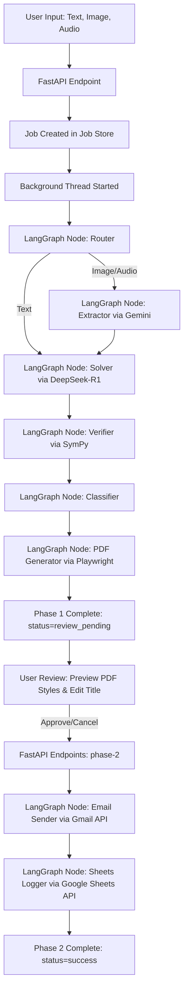

# Math AI Agent - Complete Systems Architecture & Handover Manual

Welcome. This document contains a comprehensive, exhaustive, and component-level breakdown of the **Math AI Agent** project. It is written to serve as a complete technical guide for any incoming developer, code generation engine, or LLM (such as Claude, Codex, Gemini, or GPT). By reading this single file, a new model will possess full context of all design decisions, API contracts, threading models, rendering logic, and visual components.

---

## Table of Contents
1. **System Overview & Pipeline Trace**
2. **Backend Architecture (`/backend`)**
   - `main.py`
   - `api/routes.py` (API Contracts & Request/Response schemas)
   - `services/job_store.py` (In-memory state management)
   - `services/agent_runner.py` (Threading & Phase 1/Phase 2 workflows)
3. **Agent Package & LangGraph Pipeline (`/maths_ai_agent`)**
   - `graph.py` (State Graph construction & conditional routing)
   - `models/state.py` (Structured AgentState fields)
   - `agents/input_router.py` (Classification node)
   - `agents/gemini_extractor.py` (Multimodal vision/audio extraction node)
   - `agents/deepseek_solver.py` (LaTeX solution generation node)
   - `agents/verifier.py` (SymPy mathematical validation node)
   - `agents/classifier.py` (Math taxonomy categorization node)
   - `agents/pdf_generator.py` (Playwright compiler triggering node)
   - `agents/email_sender.py` (Gmail SMTP/MIME delivery node)
   - `agents/sheets_logger.py` (Google Sheets 12-column database logger node)
4. **PDF Render Engine (`/maths_ai_agent/services/pdf_service.py`)**
   - HTML/CSS Style Sheet templates (Clean Academic, Luxury Dark, Exam Sheet, etc.)
   - Markdown-to-HTML compilation with LaTeX mathematical delimiter protection
   - Asyncio-safe Playwright worker thread isolation
5. **Frontend Application (`/frontend`)**
   - `app/page.tsx` (Dashboard logic, API polling, styling state, review controls)
   - `components/ui/background-boxes.tsx` (Performance-tuned CSS Grid hover matrix)
   - `components/agent/` components (Timeline, Input Cards, Bento grids, Solution Accordions)
6. **Authentication & OAuth configurations**
7. **Crucial Lessons Learned & Hard Constraints**
8. **Detailed Run, Test, and Build Manual**

---

## 1. System Overview & Pipeline Trace

The Math AI Agent platform provides automated math homework assistance, rigorous computer algebra validation, and professional document delivery.



### Core Execution Flow:
1. **Form Submission**: The user selects a **Solution Mode** (e.g. *Full Explanation*, *Exam Mode*) and a **PDF Style** (e.g. *Clean Academic*, *Luxury Dark*), types or uploads a mathematical problem, and submits.
2. **Phase 1 (Solve & Verify)**: The FastAPI server launches a background thread to execute the LangGraph state machine. DeepSeek-R1 generates a rich Markdown/LaTeX solution. SymPy extracts equations to verify mathematical equality. Playwright renders a PDF. The backend changes the job status to `review_pending` and exposes a secure PDF download link.
3. **Phase 2 (User Approval & Delivery)**: The frontend displays the timeline as pending and renders a **Review Panel**. The user can dynamically change the PDF style (the backend regenerates the PDF immediately on requests to `/api/pdf/{job_id}`). When the user clicks **Approve**, the backend sends the PDF attachment via Gmail and appends all details to a 12-column Google Sheet.

---

## 2. Backend Architecture (`/backend`)

The backend is built with **FastAPI** to handle fast, async, non-blocking requests, serving as the mediator between the Next.js React frontend and the LangGraph execution threads.

### `main.py`
The entry file starts the server process using Uvicorn. It mounts cross-origin resource sharing (CORS) middleware to allow the frontend to access endpoints, and registers the `/api` routing prefix:
```python
from fastapi import FastAPI
from fastapi.middleware.cors import CORSMiddleware
import uvicorn
from api.routes import router as api_router

app = FastAPI(
    title="Maths AI Agent API",
    description="Backend API wrapper for the LangGraph-based Maths AI Agent",
    version="1.0.0"
)

app.add_middleware(
    CORSMiddleware,
    allow_origins=["*"],
    allow_credentials=True,
    allow_methods=["*"],
    allow_headers=["*"],
)

app.include_router(api_router, prefix="/api")

if __name__ == "__main__":
    uvicorn.run(app, host="127.0.0.1", port=8000)
```

---

### `api/routes.py`
Exposes the endpoints for starting runs, updating review states, fetching logs, and downloading/rendering PDFs.

#### Endpoint 1: `/solve/text` (POST)
* **Request Body**:
  ```json
  {
    "problem_text": "Solve the integral of x^2 dx from 0 to 3",
    "recipient_email": "student@example.com",
    "solution_mode": "Full Explanation Mode",
    "pdf_style": "Clean Academic"
  }
  ```
* **Response**:
  ```json
  {
    "job_id": "9b1deb4d-3b7d-4bad-9bdd-2b0d7b3d4b1d",
    "status": "waiting"
  }
  ```
* **Logic**: Allocates a unique UUID `job_id`, registers it in `job_store` as `waiting`, and runs `start_agent_job(...)` which kicks off the LangGraph background thread.

#### Endpoint 2: `/solve/image` (POST)
* **Form Parameters**:
  - `file`: Binary file (PNG, JPG, JPEG, WEBP)
  - `recipient_email`: string
  - `solution_mode`: string
  - `pdf_style`: string
* **Logic**: Saves the image to `maths_ai_agent/outputs/uploads/` with a unique UUID-hashed filename to prevent collisions, creates the job in `job_store`, and kicks off the background thread.

#### Endpoint 3: `/solve/audio` (POST)
* **Form Parameters**:
  - `file`: Binary file (MP3, WAV, M4A, OGG)
  - `recipient_email`: string
  - `solution_mode`: string
  - `pdf_style`: string
* **Logic**: Similar to `/solve/image`. Saves the audio to disk and triggers the background extractor threads.

#### Endpoint 4: `/job/{job_id}` (GET)
* **Response**: Returns the live state of the job. Used for frontend polling:
  ```json
  {
    "job_id": "9b1deb4d-3b7d-4bad-9bdd-2b0d7b3d4b1d",
    "status": "review_pending",
    "progress_step": "review_pending",
    "input_type": "text",
    "input_content": "...",
    "user_email": "student@example.com",
    "pdf_url": "/api/pdf/math_solution_202606d_184045_184c89.pdf",
    "result": { ... },
    "error": null
  }
  ```

#### Endpoint 5: `/job/{job_id}/approve-email` (POST)
* **Request Body**:
  ```json
  {
    "recipient_email": "student@example.com",
    "title_overwrite": "Integrals: Standard Power Rule",
    "pdf_style": "Luxury Dark"
  }
  ```
* **Logic**: Starts Phase 2 execution. Instructs the agent to send the email with the PDF attachment and log results to Google Sheets.

#### Endpoint 6: `/job/{job_id}/cancel-email` (POST)
* **Request Body**: Same as `/approve-email`.
* **Logic**: Starts Phase 2, but skips email delivery (marks email status as `Cancelled`). It still logs the details to Google Sheets.

#### Endpoint 7: `/pdf/{job_id}` (GET)
* **Parameters**:
  - `pdf_style` (Optional query parameter, e.g. `Luxury Dark`)
* **Logic**: Allows the frontend review panel to preview the generated PDF. If the user passes a `pdf_style` that differs from the job's current style, **the backend regenerates the PDF immediately on the fly** by calling `pdf_generator_node(final_state)` with the updated styling parameters and updates `job_store`. Returns the binary file stream as `application/pdf`.

---

### `services/job_store.py`
A simple in-memory job registry. It tracks all running jobs, their logs, and results in a dictionary cache.
```python
import time
from typing import Dict, Any, Optional

class JobStore:
    def __init__(self):
        self.jobs: Dict[str, Dict[str, Any]] = {}
        
    def create_job(self, job_id: str, input_type: str, input_content: str, user_email: str, solution_mode: str, pdf_style: str):
        self.jobs[job_id] = {
            "job_id": job_id,
            "status": "waiting",
            "progress_step": "created",
            "input_type": input_type,
            "input_content": input_content,
            "user_email": user_email,
            "solution_mode": solution_mode,
            "pdf_style": pdf_style,
            "pdf_url": None,
            "result": None,
            "error": None,
            "final_state": None,
            "created_at": time.time()
        }

    def get_job(self, job_id: str) -> Optional[Dict[str, Any]]:
        return self.jobs.get(job_id)

    def update_job(self, job_id: str, **kwargs):
        if job_id in self.jobs:
            self.jobs[job_id].update(kwargs)

job_store = JobStore()
```

---

### `services/agent_runner.py`
Handles running Phase 1 and Phase 2 loops inside daemonized OS threads (`threading.Thread`) so that long-running operations do not block FastAPI.

#### Phase 1: `run_agent_workflow`
* Loads environment variables and changes Python's working directory to `maths_ai_agent` (so local imports and credentials resolve).
* Compiles the LangGraph state machine (`graph.py`).
* Runs `app.stream(initial_state)` and iterates through execution steps, updating the job status and `progress_step` in `job_store` in real-time.
* Once the stream completes, stores the compiled `AgentState` under the job's `final_state`, creates the final structured result dictionary, and sets the status to `review_pending`.

#### Phase 2: `run_agent_phase_2`
* If the user changed the PDF style during review, it loads the job state, updates the style property, and calls the `pdf_generator_node` synchronously to regenerate the PDF.
* If approved, it calls the `email_sender_node` to deliver the email. Otherwise, sets the status to `Cancelled`.
* It calls `sheets_logger_node` to write all details to Google Sheets.
* Changes the status to `success` and `progress_step` to `completed`.

---

## 3. Agent Package & LangGraph Pipeline (`/maths_ai_agent`)

The agent engine is a structured workflow graph built with **LangGraph**. It coordinates nodes to classification, extraction, solving, validation, formatting, and logging.

### `models/state.py`
Defines the `AgentState` TypedDict which is shared between all nodes of the graph.
```python
from typing import TypedDict, List, Dict, Any, Optional

class AgentState(TypedDict):
    # Input parameters
    input_type: str                  # "text" | "image" | "audio"
    input_content: str               # Raw text or path to media file
    user_email: Optional[str]        # User's destination email
    solution_mode: str               # Mode chosen for solving
    pdf_style: str                   # Chosen visual stylesheet
    
    # Processed states
    cleaned_problem: Optional[str]   # Plain text math formulation
    solution_data: Optional[Dict[str, Any]] # JSON structure containing solution steps, title, etc.
    pdf_path: Optional[str]          # Absolute local path to generated PDF
    email_status: Optional[str]      # "Sent" | "Cancelled" | "Failed"
    google_sheet_status: Optional[str] # "Success" | "Failed"
    
    # Conditional checks
    error: Optional[str]             # Halted error state
    human_review_status: Optional[str] # "Reviewed" | "Skipped"
    email_approved: Optional[bool]   # User decision
```

---

### `graph.py`
Configures the nodes and structural routing of the state machine.
```python
from langgraph.graph import StateGraph, START, END
from models.state import AgentState
from agents.input_router import input_router_node
from agents.gemini_extractor import gemini_extractor_node
from agents.deepseek_solver import deepseek_solver_node
from agents.verifier import verifier_node
from agents.classifier import classifier_node
from agents.pdf_generator import pdf_generator_node

def should_extract(state: AgentState) -> str:
    if state.get("error"): return "end"
    if state.get("input_type") in ["image", "audio"]: return "extract"
    return "solve"

def check_error(state: AgentState) -> str:
    if state.get("error"): return "log"
    return "continue"

def build_graph():
    workflow = StateGraph(AgentState)
    
    workflow.add_node("router", input_router_node)
    workflow.add_node("extractor", gemini_extractor_node)
    workflow.add_node("solver", deepseek_solver_node)
    workflow.add_node("verifier", verifier_node)
    workflow.add_node("classifier", classifier_node)
    workflow.add_node("pdf", pdf_generator_node)
    
    workflow.add_edge(START, "router")
    workflow.add_conditional_edges("router", should_extract, {
        "extract": "extractor",
        "solve": "solver",
        "end": "logger"
    })
    workflow.add_conditional_edges("extractor", check_error, {"continue": "solver", "log": "logger"})
    workflow.add_conditional_edges("solver", check_error, {"continue": "verifier", "log": "logger"})
    
    workflow.add_edge("verifier", "classifier")
    workflow.add_edge("classifier", "pdf")
    workflow.add_edge("pdf", END)
    
    return workflow.compile()
```

---

### Node 1: `input_router.py`
Determines if input is plain text or media. If it is plain text, sanitizes whitespace and populates `cleaned_problem`.

---

### Node 2: `gemini_extractor.py`
Uses **Gemini 2.5 Flash** (via `google-genai` / `gemini-2.5-flash` model) to parse media.
* **Image extraction**: Evaluates layout, detects handwritten formulas, and outputs clean LaTeX equations wrapped in standard delimiters.
* **Audio extraction**: Transcribes the recording using OpenRouter's speech-to-text API (with `openai/whisper-large-v3` model) to transcribe mathematical problem descriptions spoken by the user.

---

### Node 3: `deepseek_solver.py`
The core LLM node. It sends the problem to **DeepSeek-R1** (via OpenRouter) using structured system instructions.
* **Prompt Instructions**: Requires the model to output a strictly structured JSON block containing:
  - `title`: Short title of the math problem
  - `primary_solution`: Step-by-step mathematical reasoning. Must include LaTeX equations wrapped in `$$ ... $$` for display and `$ ... $` for inline math.
  - `final_answer`: The final simplified result.
  - `alternative_solutions`: An array of alternative solving methods. Each method includes `title`, `method`, `when_to_use`, `elegance_score`, and `solution`.
* **Robust JSON Extraction**: Strips the `<think>...</think>` block completely to prevent any mathematical curly braces (`{...}`) inside the model's reasoning process from corrupting the JSON parsing block, then isolates the JSON block inside markdown tags.

---

### Node 4: `verifier.py`
Verifies math solutions using **SymPy** for algebra.
* **Math verification**: Parses mathematical strings (e.g. equations, integrals) into SymPy expressions and evaluates if the model's steps are algebraically correct.
* **Confidence Engine**: Dynamically calculates a confidence score from 0-100:
  - Base score is determined by SymPy verification result (90+ if verified, lower if unverified or containing potential logical gaps).
  - Deducts points for risk factors, formatting violations, or long unverified logical steps.
  - Evaluates potential weak reasoning points and assigns a `risk_level` ("Low", "Medium", "High").

---

### Node 5: `classifier.py`
Uses Gemini to categorize the problem inside a mathematical taxonomy:
* `mathematical_field`: e.g. Algebra, Calculus, Analysis, Geometry, Statistics, Linear Algebra.
* `detailed_branch`: e.g. Integral Calculus, Matrix Diagonalization, Probability Distributions.
* `academic_level`: e.g. Middle School, High School, Undergraduate, Graduate.
* `typical_course`: e.g. Calc I, Real Analysis, Abstract Algebra.
* `tags`: array of keywords (e.g. `["integration", "parts", "harmonic"]`).

---

### Node 6: `pdf_generator.py`
Kicks off the PDF compiler service. It receives the `solution_data` and path references, and calls `generate_pdf` to write the compiled PDF document to `/outputs/pdfs/`.

---

### Node 7: `email_sender.py`
Fires only during Phase 2. Uses Gmail's API to construct a MIME email.
* Retrieves the OAuth token from `token.json` (or logs in using `credentials.json`).
* Builds a multipart email containing a friendly HTML status update, KaTeX formulas, and attaches the compiled PDF file.

---

### Node 8: `sheets_logger.py`
Appends details to a Google Sheet. It is constrained by a strict **12-column layout**.
* **Columns list**:
  1. `ID` (Short job UUID hash)
  2. `Date` (Format: `YYYY-MM-DD HH:MM:SS`)
  3. `Problem Title` (Solution title)
  4. `Difficulty` (Maps directly to `academic_level` to maintain column constraint)
  5. `Field` (e.g. Algebra, Calculus)
  6. `Problem` (Raw cleaned text formulation)
  7. `Final Answer` (Cleaned final result)
  8. `Verification` (Verification status e.g. "SymPy Verified", "LLM Reviewed")
  9. `PDF File` (Filename of the generated PDF)
  10. `Email` (User's recipient address)
  11. `Status` (Email delivery status: "Sent", "Cancelled", "Failed")
  12. `Notes` (Verification notes or SymPy outputs)
* **Verification**: Checks row counts to append entries cleanly to the next available row.

---

## 4. PDF Render Engine (`/maths_ai_agent/services/pdf_service.py`)

Generates styled PDFs from Markdown and LaTeX. 

### Stylesheets:
1. **Clean Academic**: Blue accents (`#1e3a8a`), clean borders (`border-slate-200`), serif-free fonts (`Inter`).
2. **Luxury Dark**: Deep slate look (`#0b0f19` background, `#f8fafc` text), emerald-green cards (`#064e3b`) for answers, and glowing neon blue borders.
3. **Exam Sheet**: Traditional paper style. Times New Roman font, double lines, no colors, no box styles.
4. **Professor Notes**: Warm sepia background (`#fffaf0`), dotted gold-brown cards (`#d69e2e`), and handwritten style accents.
5. **Minimal LaTeX**: Emulates LaTeX article styling. Minimalistic, centered titles, no backgrounds, italic chips.

---

### Delimiter Protection & Markdown Compilation:
When compiling Markdown text to HTML, normal markdown parsers will break LaTeX symbols (like `$$` or `_` math subscripts). To prevent this, `pdf_service` performs **delimiter protection**:
1. It identifies mathematical blocks wrapped in display delimiters (`$$`, `\[`) or inline delimiters (`$`, `\(`).
2. Replaces them with unique tokens (e.g., `MATH_PLACEHOLDER_0_END`) to protect them.
3. Compiles the remaining plain text to HTML using python's `markdown` library (enabling `fenced_code` and `tables` extensions).
4. Replaces the protected placeholders back with their original LaTeX math delimiters.
5. Feeds the HTML page to Playwright, which loads the **KaTeX auto-render extension** on load to typeset all mathematical symbols in the browser.

---

### Playwright Event Loop Worker Thread Fix
As discussed in Section 7, Playwright's synchronous API cannot run in a thread with an active `asyncio` event loop. To resolve this, `pdf_service.py` executes the rendering code in a clean, newly spawned OS thread:
```python
import os
import threading
from playwright.sync_api import sync_playwright

def generate_pdf(solution_data: dict, output_path: str, pdf_style: str = "Clean Academic"):
    # ... template compilation and markdown rendering ...
    
    os.makedirs(os.path.dirname(output_path), exist_ok=True)
    temp_html = output_path + ".html"
    with open(temp_html, "w", encoding="utf-8") as f:
        f.write(html_content)

    def render_worker():
        with sync_playwright() as p:
            browser = p.chromium.launch()
            page = browser.new_page()
            page.goto(f"file:///{os.path.abspath(temp_html).replace(chr(92), '/')}")
            page.wait_for_load_state("networkidle")
            page.wait_for_timeout(2000)
            page.pdf(path=output_path, format="A4", print_background=True, 
                     margin={"top": "20px", "bottom": "20px", "left": "20px", "right": "20px"})
            browser.close()

    thread_exceptions = []
    def run_worker():
        try:
            render_worker()
        except Exception as e:
            thread_exceptions.append(e)

    thread = threading.Thread(target=run_worker)
    thread.start()
    thread.join()

    if thread_exceptions:
        raise thread_exceptions[0]
        
    if os.path.exists(temp_html):
        os.remove(temp_html)
```

---

## 5. Frontend Application (`/frontend`)

The frontend is a React 19 application built with Next.js using Tailwind CSS v4.

### `app/page.tsx`
The primary entry page.
* **State Managers**:
  - `jobId`: Tracks the active UUID.
  - `job`: Live state dictionary returned from the polling endpoint.
  - `selectedStyle`: Tracks the active PDF preview stylesheet.
* **API Polling Loop**: When a job is submitted, triggers an `setInterval` loop to query `/api/job/{job_id}` every 1.5 seconds.
  - If status is `review_pending`, it pauses polling and opens the review panel.
  - If status is `success` or `error`, it clears the interval and displays the final dashboard view.
* **Animated Video Background**: Renders `Videobackground.mp4` playing on loop silently (`autoPlay`, `loop`, `muted`, `playsInline`) under `z-0` using `object-cover`.
* **Overlay Blending**: Integrates the background video with the interactive animated grid boxes overlay using `mix-blend-overlay` to produce a sleek dark-tech aesthetic.

---

### `components/ui/background-boxes.tsx`
Renders an animated isometric background grid.
* **CSS Grid structure**: Renders a flat container spanning `150%` height/width, positioned absolutely under `z-0` with no `pointer-events` blockers on its parent wrapper.
* **Isometric Skew**:
  `transform: 'translate(-15%, -20%) skewX(-48deg) skewY(14deg) scale(0.8) rotate(0deg) translateZ(0)'`
* **Tailwind v4 border-solid fixes**: Explicitly sets `border-solid` along with `border-r border-b border-slate-700/20` on each box element so that lines display correctly.
* **Hover captures**: Grid boxes have a 1% opacity fill (`bg-slate-950/0.01`) so they register hovers. On hover, Framer Motion changes their background color to a random neon color, fading back to transparent over 1.5 seconds.

```tsx
"use client";
import React from "react";
import { motion } from "framer-motion";
import { cn } from "../../lib/utils";

export const BoxesCore = ({ className, ...rest }: { className?: string }) => {
  const columns = 24;
  const rows = 16;
  const totalBoxes = columns * rows;
  const colors = ["#7dd3fc", "#fbcfe8", "#86efac", "#fde047", "#fca5a5", "#d8b4fe", "#93c5fd", "#c7d2fe", "#ddd6fe"];
  const getRandomColor = () => colors[Math.floor(Math.random() * colors.length)];

  return (
    <div
      style={{
        transform: `translate(-15%, -20%) skewX(-48deg) skewY(14deg) scale(0.8) rotate(0deg) translateZ(0)`,
        gridTemplateColumns: `repeat(${columns}, 1fr)`,
        gridTemplateRows: `repeat(${rows}, 1fr)`,
      }}
      className={cn("absolute left-0 top-0 z-0 grid w-[150%] h-[150%] p-4 gap-0 border-l border-t border-solid border-slate-700/20 bg-slate-950/0.01", className)}
      {...rest}
    >
      {Array.from({ length: totalBoxes }).map((_, index) => {
        const r = Math.floor(index / columns);
        const c = index % columns;
        return (
          <motion.div
            key={index}
            whileHover={{ backgroundColor: getRandomColor(), transition: { duration: 0 } }}
            animate={{ backgroundColor: "rgba(0, 0, 0, 0)", transition: { duration: 1.5 } }}
            className="relative border-r border-b border-solid border-slate-700/20 w-full h-full bg-slate-950/0.01 flex items-center justify-center"
          >
            {r % 2 === 0 && c % 2 === 0 && (
              <svg xmlns="http://www.w3.org/2000/svg" fill="none" viewBox="0 0 24 24" strokeWidth="1.5" stroke="currentColor" className="w-5 h-5 stroke-[0.5] text-slate-700/30 pointer-events-none select-none">
                <path strokeLinecap="round" strokeLinejoin="round" d="M12 6v12m6-6H6" />
              </svg>
            )}
          </motion.div>
        );
      })}
    </div>
  );
};
export const Boxes = React.memo(BoxesCore);
```

### `components/agent/AgentInputCard.tsx`
Renders the multi-tab user input form (Text, Image, Voice Memo) along with solution mode dropdown cards, style selectors, and delivery configuration.
* **Real-time Voice Recorder**: Under the "Voice Memo" tab, users can record their voice directly using the browser's `MediaRecorder` API. It features:
  - Visual Sound Waves: Framer Motion animated waves indicating sound activity.
  - Recording State: Red pulsating indicator with a duration timer (limit: 2 minutes).
  - Playback Preview: Native browser audio player to review the memo before submission.
  - Upload Toggle: Toggles back to local file dropzone if the user prefers uploading pre-recorded files.

---

### `components/agent/WorkflowTimeline.tsx`
Renders the live pipeline progress steps.
* **Pipeline steps**:
  1. `input_received` (Problem submitted)
  2. `cleaning_problem` (Analyzing structure)
  3. `gemini_extracting` (Vision/Audio processing)
  4. `deepseek_solving` (DeepSeek solving math)
  5. `verifying_solution` (SymPy mathematical check)
  6. `classifying_problem` (Taxonomy classification)
  7. `generating_pdf` (Rendering PDF)
  8. `review_pending` (Awaiting review)
  9. `sending_email` (Delivering document)
  10. `logging_to_google_sheets` (Saving logs)
  11. `completed` (Done)

---

### `components/agent/HumanReviewPanel.tsx`
Renders options during the `review_pending` phase.
* **Layout**: Uses a split-pane layout:
  - **Left Pane (Review Controls)**: Exposes email override input, title override input, PDF style theme pills, and "Approve & Deliver" or "Skip Email" actions.
  - **Right Pane (PDF Live Preview)**: Mounts an `<iframe>` referencing `/api/pdf/{job_id}?pdf_style={selectedStyle}` that updates in real-time when the user selects a different style pill.
* **Dynamic styles regeneration**: Updates the active style pill, which sends a query to the preview route. This triggers the backend to regenerate the PDF and refresh the iframe.

---

### `components/agent/SolutionPreview.tsx`
Uses **KaTeX** to render the step-by-step LaTeX output from DeepSeek-R1.
* **Math parsing**: Parses the solution string and replaces standard block (`$$...$$`, `\[...\]`) or inline (`$...$`, `\(...\)`) math delimiters with rendered KaTeX formulas.
* **Alternative Solutions Accordion**: If the verifier output contains alternative methods, compiles them into an accordion list showing the method name, elegance rating (1-5 stars), and use cases.

---

## 6. Authentication & OAuth Configurations

The agent uses Google APIs for email delivery and spreadsheet logging.

### 1. Credentials File (`credentials.json`)
The client secret file generated from the Google Cloud Console. Contains client ID, project ID, auth URI, token URI, and client secrets. Placed at `maths_ai_agent/credentials.json`.

### 2. Token File (`token.json`)
Generated automatically on the first run. If missing, the agent starts a local OAuth flow, opening a browser tab to authenticate using the scopes:
* `https://www.googleapis.com/auth/gmail.send`
* `https://www.googleapis.com/auth/spreadsheets`
It saves the credentials to `maths_ai_agent/token.json` for subsequent runs.

---

## 7. Crucial Lessons Learned & Hard Constraints

> [!IMPORTANT]
> **Playwright asyncio compatibility**: Do not invoke `sync_playwright` directly inside asynchronous API routes or LangGraph runs. Always isolate it in a standard python thread (`threading.Thread`) and block with `thread.join()` to avoid thread event loop crashes.

> [!WARNING]
> **Google Sheets column layout**: The columns are hard-coded in the logger. Changing the structure or count will throw errors. The schema must match exactly 12 columns in order.

> [!NOTE]
> **Tailwind v4 preflight styles**: Tailwind v4 preflight does not set default border styles to solid. Always use `border-solid` alongside directional border classes (e.g. `border-l border-solid`) to ensure they are visible.

---

## 8. Detailed Run, Test, and Build Manual

### Start the entire environment:
1. Open a terminal and run the backend FastAPI server:
   ```bash
   cd backend
   python main.py
   ```
2. Open a second terminal and run the frontend server:
   ```bash
   cd frontend
   npm run dev
   ```
3. Open **[http://localhost:3000](http://localhost:3000)** in your browser.

### Run PDF generation tests:
To verify that Playwright compiles PDFs without event loop conflicts:
```bash
cd maths_ai_agent
python -m pytest tests/test_pdf_generation.py
```
This runs the test suite and cleans up the generated PDF file automatically.
